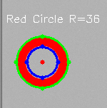
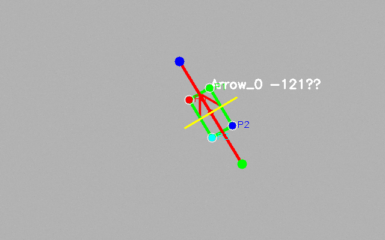

# 目标发送要求
    为了检测选手识别的准确性，要求选手对于不同的目标发送不同的目标边缘点信息。
  特别提醒:  **发送消息的目标要严格按照要求的位置和顺序，比赛时若因此导致分数错误概不负责**（详情见例程书写规范）  

  ## 球
  发送正面圆上的四个点，左点为起始逆时针方向的四个点

  

  ## 立方体
  发送正面方形上的四个点，左下点为起始逆时针方向的四个点

  

  ## 装甲板
  发送正面矩形上的四个点，左下点为起始逆时针方向的四个点
  长0.705, 宽0.230（宽度是灯条的宽度）

  
## 环
发送内外层环上的四个点，左点为起始逆时针方向的四个点
类似球的发送方式

  
## 箭头
发送箭头外接矩形上的四个点，（严格按照顺序发送 ）
左上点为起始顺时针方向的四个点

  